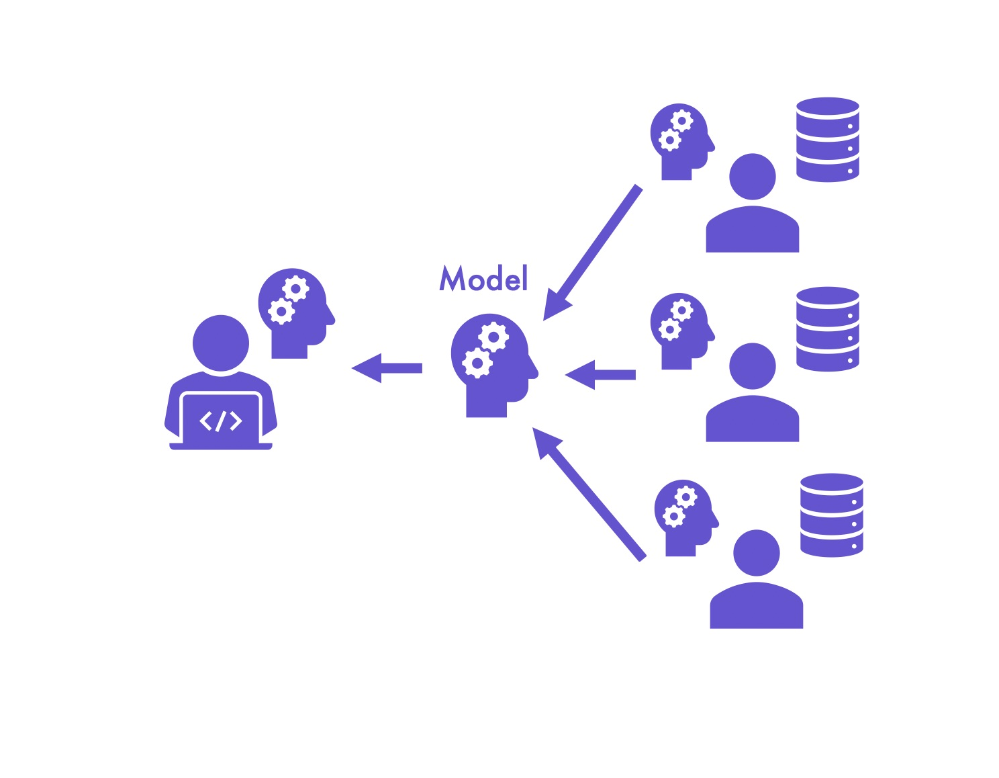

# Getting Started
The requirements to build federated-learning-sdk are:
* OS: Windows/Linux/Mac OS
* Python: version 3.7
* Pytorch: version 1.4
* PySyft: version 0.28

Clone the repository
```
git clone https://github.com/good-data-foundation/federated-learning-sdk.git
```
Then, You can enter folder example to learn how to use federated-learning-sdk.
# Federated Learning sdk
Welcome to the federated-learning-sdk source code repository! This is a machine learning warehouse based on federated learning, differential privacy, homomorphic encryption and blockchain. You can use your visible and invisible data to train a shared model by using it.

# What is Federated Learning?
Federated learning (also known as collaborative learning) is a machine learning technique that trains an algorithm across multiple decentralized edge devices or servers holding local data samples, without exchanging them. This approach stands in contrast to traditional centralized machine learning techniques where all the local datasets are uploaded to one server, as well as to more classical decentralized approaches which often assume that local data samples are identically distributed. 

Federated learning enables multiple actors to build a common, robust machine learning model without sharing data, thus allowing to address critical issues such as data privacy, data security, data access rights and access to heterogeneous data. Its applications are spread over a number of industries including defense, telecommunications, IoT, and pharmaceutics.

## Horizontal learning
Horizontal learning is about developing competencies such as communication and active listening skills, responding effectively and constructively to conflict, or increasing technical expertise.

The main focus of horizontal learning is the functional development of knowledge, skills, and behaviors that strengthen your key competencies. Horizontal learning focuses on what you know. It represents the knowledge and skills you acquire while operating at a specific stage of growth and development, your own particular level of cognitive, emotional, and relational complexity.

## Vertical learning
Vertical learning is about the transformation of how you think, feel, and make sense of the world; it is about increasing the complexity of how you see and relate to the world and to what you know.

It includes the development of both mental complexity and emotional intelligence. While occurring naturally, vertical learning can also be accelerated by 3 to 5 times under the right sort of learning environment—one that combines optimally balanced challenge and support. How you know something is often more important than what you know! Nearly all organizational development is based on a horizontal learning approach. Only a few organizations use an organizational development process that acknowledges the power of vertical learning.

Vertical learning models were developed by Dr. Robert Kegan, Harvard University, and Dr. William Torbert, Boston College.
